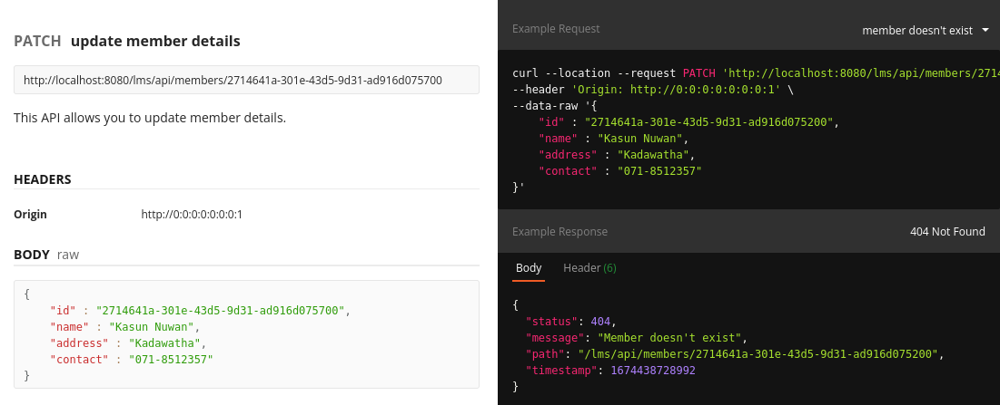
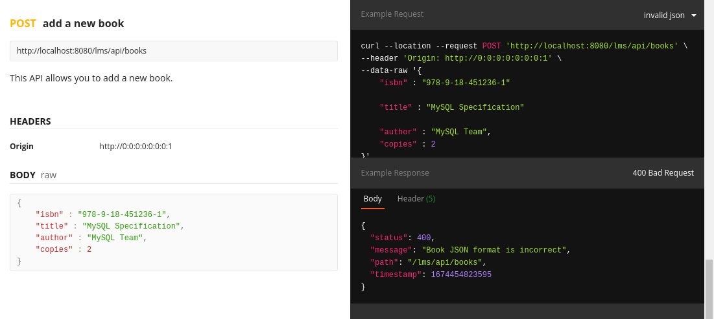
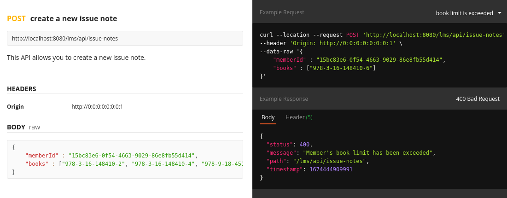
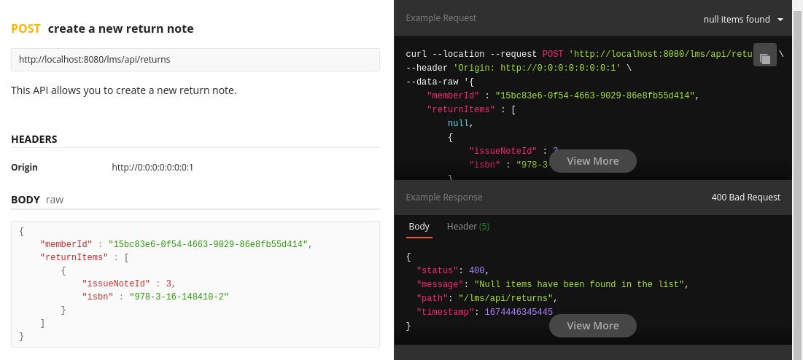
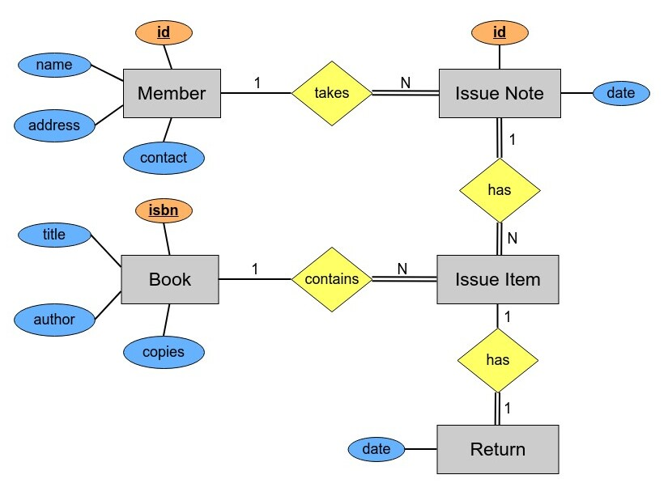

# Library Management System - Back End 

This project was initially developed as a **monolithic design**, and then 
**n-tier architecture** was applied to the project in order to understand and improve the knowledge of software architectures. 
Web services are exposed as APIs under the **members**, **books**, **issue-notes** and **returns** resources in this project.

More information on the exposed web services with example test cases can be found in the 
API documentations listed below.
- [**Members API documentation**](https://documenter.getpostman.com/view/25306703/2s8ZDa224j)
- [**Books API documentation**](https://documenter.getpostman.com/view/25306703/2s8ZDa229D)
- [**Issue-Notes API documentation**](https://documenter.getpostman.com/view/25306703/2s8ZDa2M6F)
- [**Returns API documentation**](https://documenter.getpostman.com/view/25306703/2s8ZDa2MEy)

#### Highlighted features of the application,
- Members are registered to the system by [**UUID**](https://en.wikipedia.org/wiki/Universally_unique_identifier), and no two members can have the same contact number.
- Books are registered to the system by international standard book number (isbn).
- When members take books from the library they will receive an issue note.
- The issue note contains all the take away book ISBNs along with the member UUID.
- All issue notes have unique issue id to uniquely identify them when the books are returned.
- Issue note can only have maximum 3 distinct ISBNs.
- A member cannot take the same book from the system twice at the same time or at two different times (with another issue note).
- A member can only take maximum of 3 different books from the system. If he/she needs another, he/she must return a book that he/she already got.

The project was tested in test directory using **h2** in-memory RDBMS.

Monolithic design of the project (without layered architecture) can be downloaded from [**here**](https://github.com/PubuduJ/library-management-system-back-end/releases/tag/monolithic-design).

#### Few snapshots of the documentation
- An attempt to update a member that does not exist in the database. 

- Send incorrect JSON in request payload. 

- A member requests more than 3 books. 

- Null return items found in request payload. 

#### ERD of the database

## Used Technologies

- Java SE 11
- Jakarta Servlet 5.0
- Apache Tomcat 10.1.1
- Apache Maven 3.8.6
- MySQL Community Server 8.0.31
- Added dependencies to pom.xml
    - jakarta.servlet-api 5.0.0
    - jakarta.annotation-api 2.0.0
    - lombok 1.18.24
    - yasson 2.0.4
    - mysql-connector-j 8.0.31
    - modelmapper 3.1.0
    - logback 1.4.2
    - slf4j 2.0.5
    - h2 2.1.212
    - junit-jupiter-api
    - junit-jupiter-engine

#### Used Integrated Development Environment
- IntelliJ IDEA

## How to use ?
This project can be used by cloning the 
project to your local computer.

Make sure to create a **lms_db** database in the MySQL community server and add all the tables from the **lms_db.sql** file to it.
You can find the lms_db.sql for this project under the **resources** directory.

#### Clone this repository
1. Clone the project using `https://github.com/PubuduJ/library-management-system-back-end.git` terminal command.
2. Open the `pom.xml` file from **IntelliJ IDEA**, make sure to open this as a project.
3. In order to run this application, you have to set up a connection pool with the help of **JNDI** under the name of **jdbc/lms_db**.
4. You can use Jakarta EE application server or web container or servlet container to run the project. (Apache Tomcat 10.1.1 is recommended)
5. Use application context as **/lms/api**

## Credits
This project was carried out under the guidance of the [IJSE](https://www.ijse.lk/) Direct Entry Program 9.

## Version
v1.2.0

## License
Copyright &copy; 2023 [Pubudu Janith](https://www.linkedin.com/in/pubudujanith94/). All Rights Reserved. 
This project is licensed under the [MIT license](LICENSE.txt).